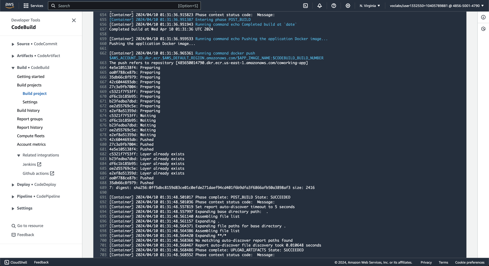

# Coworking Space Service Extension

The Coworking Space Service is a set of APIs that enables users to request one-time tokens and administrators to authorize access to a coworking space. This service follows a microservice pattern and the APIs are split into distinct services that can be deployed and managed independently of one another.

## Release docker application image

To release a new version for the docker image:

### Trigger docker image build

Merging a PR on GitHub will automatically trigger a Codebuild pipeline to build a new docker image of the python application `analytics/`.
However, you can manually trigger this build also on AWS Codebuild




### Configure AWS auth credentials


```bash
aws configure
```
Additionally you can also export the following values in the terminal 
export AWS_ACCESS_KEY_ID=
export AWS_SECRET_ACCESS_KEY=
export AWS_SESSION_TOKEN=


### Create a cluster with eksctl CLI tool

```bash
eksctl create cluster --name coworking --version 1.29 --region us-east-1 --nodegroup-name coworking-nodes --node-type t3.small --nodes 1 --nodes-min 1 --nodes-max 2
```

### Configure kubectl to interact with EKS cluster


```bash
aws eks --region us-east-1 update-kubeconfig --name coworking
```

It initializes $HOME/.kube/config the first time it's run, so that kubectl can have the right cluster details to connect to EKS


### Apply manifest to EKS cluster

```bash
kubectl apply -f deployment/
```

Resources would be created if they don't exist and updated if they already exist

## Setup DB

### Add Bitnami repo to Helm

```bash
helm repo add bitnami https://charts.bitnami.com/bitnami
```

### Install Postgres Helm chart

```bash
helm install coworking-postgresql-db bitnami/postgresql -f helm-configs/helm-postgresql-values.yaml 
```

### Verify services creation

```bash
kubectl get svc
```


```bash
kubectl describe deployment coworking
```


```bash
kubectl describe deployment coworking-postgresql-db
```


Confirm db credentials
`DB_HOST` in ./deployment/configmap.yml matches the postgres connection host `coworking-postgresql-db.default.svc.cluster.local`
`DB_PASSWORD` in ./deployment/configmap.yml matches the postgres password
Check base64 encoded password with `kubectl get secret --namespace default coworking-postgresql-db -o jsonpath="{.data.postgres-password}"` and set it as DB_PASSWORD secret.

if you made changes to the manifest, apply the changes to the cluster by running the command agin:  

```bash
kubectl apply -f deployment/
```

### Create DB tables and seed data

#### Export postgres password in your terminal

```bash
export POSTGRES_PASSWORD=$(kubectl get secret --namespace default coworking-postgresql-db -o jsonpath="{.data.postgres-password}" | base64 -d)
```

#### Connect to your database from outside the cluster 

```bash
kubectl port-forward --namespace default svc/coworking-postgresql-db 5432:5432 &
    PGPASSWORD="$POSTGRES_PASSWORD" psql --host 127.0.0.1 -U postgres -d postgres -p 5432
```

This allows you to run psql commands locally and have it execute on your pod. We need it so we can run the `db/*.sql` files  located on the local machine

#### Seed data
Make sure you have postgres client installed locally to use `psql` and set/export POSTGRES_PASSWORD also in this terminal

Create tables
```bash
PGPASSWORD="$POSTGRES_PASSWORD" psql --host 127.0.0.1 -U postgres -d postgres -p 5432 < db/1_create_tables.sql
```

Seed users

```bash
PGPASSWORD="$POSTGRES_PASSWORD" psql --host 127.0.0.1 -U postgres -d postgres -p 5432 < db/2_seed_users.sql 
```

Seed tokens

```bash
PGPASSWORD="$POSTGRES_PASSWORD" psql --host 127.0.0.1 -U postgres -d postgres -p 5432 < db/3_seed_tokens.sql 
```

### Verify pods are running fine

```bash
kubectl get pods
```


